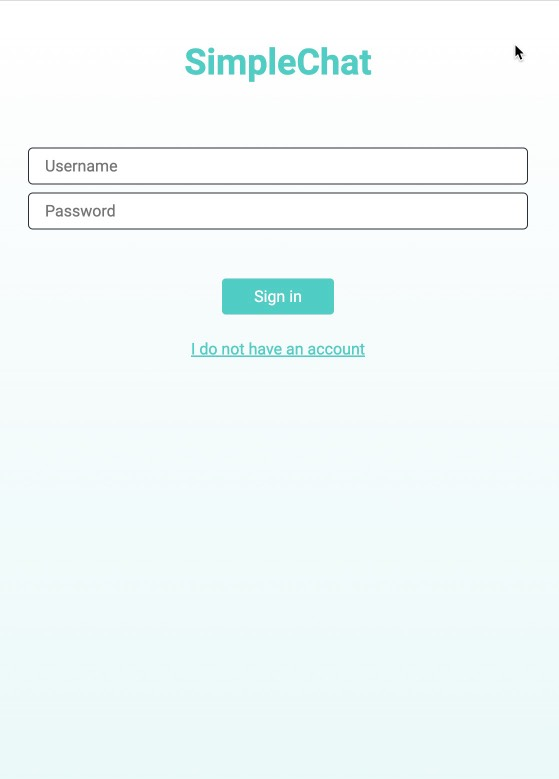
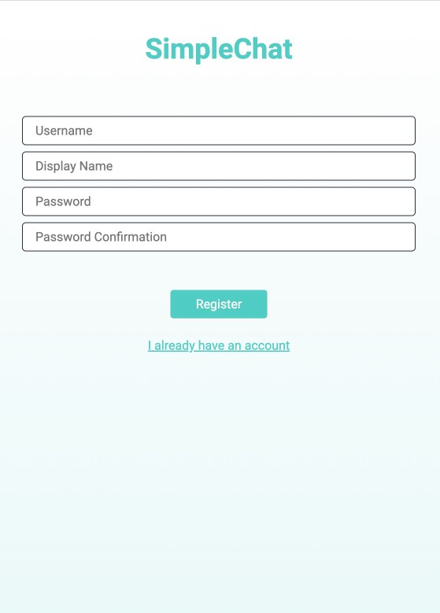
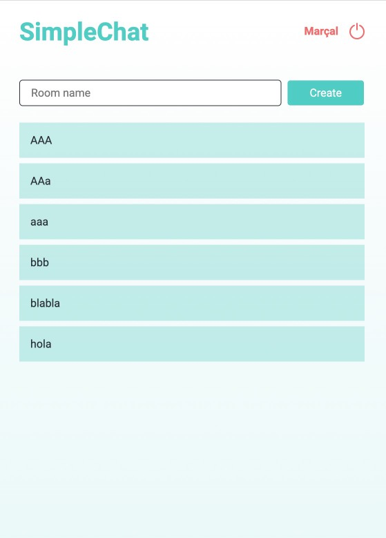
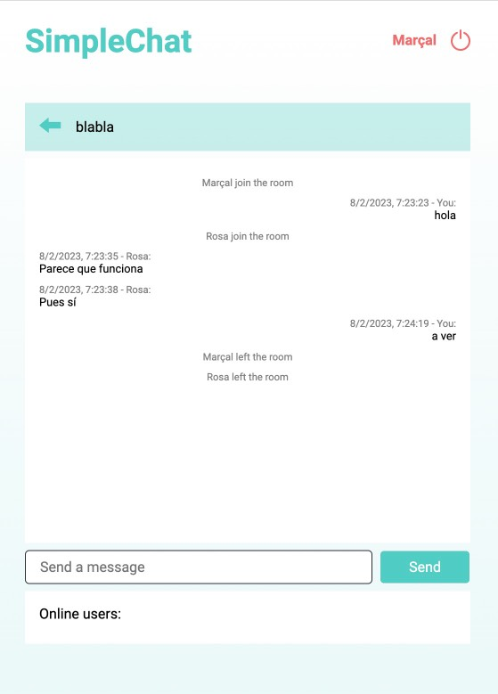

# simpleChat

Un chat simples desarollado utilizando:

- NodeJS
- React + TypeScript
- Socket.io
- Base de datos MySQL

## Como instalar

1. Descargar ese repositorio
2. (Opcional) Levantar la máquina Docker:

   ```
   cd server
   cd docker
   docker compose up
   ```

3. Configurar el archivo de entorno.
   1. Copiar el archivo `.env-template` a `.env`
   2. Modificar el archivo `.env` con la configuración de la base de datos
4. Ejecutar el servidor Node

   ```
   cd server
   npm i
   npm run start
   ```

5. Ejecutar el servidor de FrontEnd

   ```
   cd client
   npm i
   npm run start
   ```

Abrir el cliente en su navegador favorito, crear un (o más usuarios). Empezar a chatear.

## End points

### user/register

Sire para crear un nuevo usuario del chat.

`Body`

- `userName` | string | required
- `password` | string | required
- `displayName` | string | required

### user/login

Sire para validar un usuario. Retorna el token de validaicón y la información del usuario.

`Body`

- `userName` | string | required
- `password` | string | required

### user/tokeninfo

Sire para recuperar la información del chat. Retorna si el token es valido o no. Si es valido retorna la información del usuario.

`Body`

- `token` | string | required

### user/unsubscribe

Sire para dar de baja a usuario del chat.

`Body`

- `userName` | string | required
- `password` | string | required

### room/

Recupera la lista de las salas existentes

### room/create

Crea una nueva sala de chat

`Body`

- `roomName` | string | required

## Eventos del Socket

### Cliente ==> Server

- `handshake`: Usuario se connecta al chat
- `enter_room`: Usuario accede o sale de una sala
- `create_room`: Usuario crea una nueva sala
- `new_message`: Usuario crea una nueva mensaje

### Server ==> Client

- `update_rooms`: Una nueva sala fue creada
- `update_user_room`: Un usuario entró o salío de una sala
- `update_messages`: Una nueva mensaje fue añadida (por el usuario o el sistema)

## Funcionalidades del Chat

- Permite crear usuarios
- Permite identificar usuarios registrados. Los mantienen conectados por 24hs
- Permite un usuario cerrar su sesión
- Permite crear salas de chat
- Permite accede y salir de las salas de chat
- Permite enviar mensaje a todos los usuarios del chat
- Permite ver los mensajes previos, su autor y la fecha/hora que fueron enviados.
- Se detecta la conexión o desconexión de los usuarios.
- Se registra la entrada o salida de los usuarios del chat

## Capturas de pantalla





